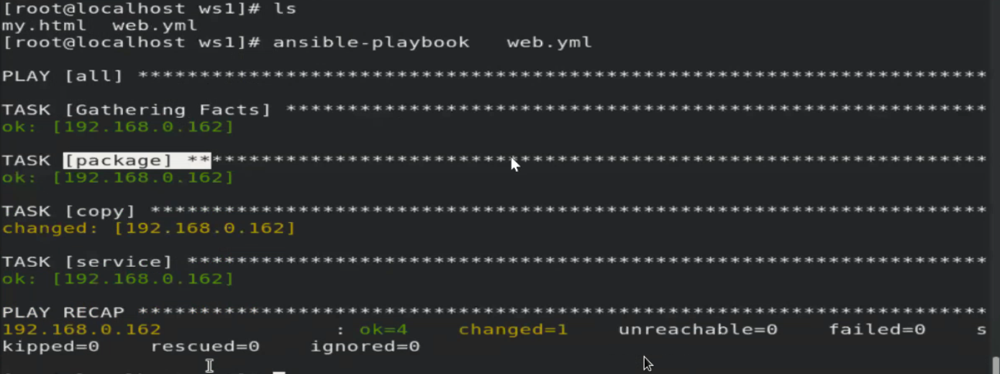
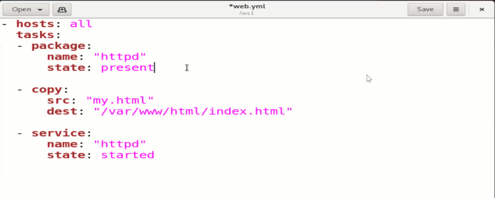
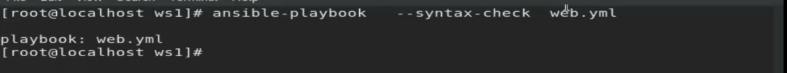

### Step1: Installing the httpd on the managed nodes.
### Step2: Start the httpd services
### Step3: Copy the the webpages to /var/www/html directory 








```yml

- hosts: all
  tasks:
  - package: 
      name: "httpd"
      state: present
  - copy:
    src: "my.html"
    dest: "/var/www/html/index.html"
    
  - service: 
    name: "httpd"
    state: started
    
```
